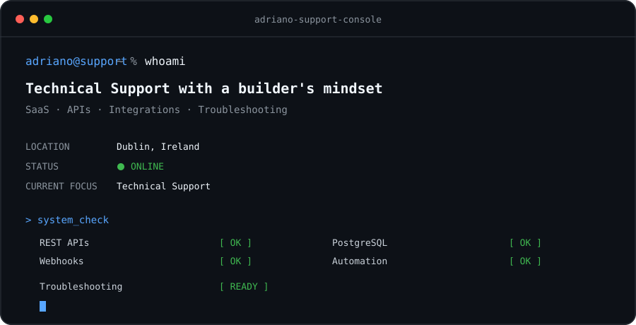

<p align="center">
  
</p>

<br>

## `> about_me`

```console
adriano@support:~$ cat profile.txt

I have a software development background and enjoy solving technical problems.

My experience building SaaS products helps me investigate issues,
understand integrations and communicate solutions clearly.
```

## `> support_toolkit`

```text
Investigation         APIs & Integrations       Systems
──────────────────    ─────────────────────     ────────────────

Troubleshooting       REST APIs                  PostgreSQL
Debugging             Webhooks                   SQL
Log Analysis          Stripe                     Docker
Root Cause Analysis   n8n                        Git
Technical Support     SaaS Integrations          Supabase
```

## `> incident_history`

| ID | Incident | Area | Status |
|:---|:---|:---|:---:|
| [`INC-001`](./incidents/INC-001-api-authentication.md) | **API Authentication Error** | API · Authentication | `RESOLVED` |
| [`INC-002`](./incidents/INC-002-webhook-failure.md) | **Webhook Processing Failure** | Webhooks · Logs | `RESOLVED` |
| [`INC-003`](./incidents/INC-003-payment-mismatch.md) | **Payment Status Mismatch** | Payments · Integration | `RESOLVED` |
| `INC-004` | Automation Workflow Error | Automation · n8n | `COMING SOON` |

**→ [`OPEN INC-001 CASE FILE`](./incidents/INC-001-api-authentication.md)**

<sub>Cases include lab scenarios and sanitized real-world troubleshooting experiences. Each case is clearly identified.</sub>

## `> current_mission`

```text
Focus        Technical Support
Environment  SaaS
Location     Dublin, Ireland

Goal         Helping users solve technical problems
             while understanding what happens behind the product.
```

## `> connect`

<p align="left">
  <a href="https://www.linkedin.com/in/adriano-aguiar">LinkedIn</a>
  &nbsp;•&nbsp;
  <a href="https://www.adrianoaguiar.tech">Portfolio</a>
</p>
