<p align="center">
  
</p>

<p align="center">
  <a href="../README.md">← SUPPORT CONSOLE</a>
  &nbsp;&nbsp;•&nbsp;&nbsp;
  <strong>INC-001 / 004</strong>
  &nbsp;&nbsp;•&nbsp;&nbsp;
  <a href="./INC-002-webhook-failure.md">NEXT INCIDENT →</a>
</p>

<br>

## `> issue`

A user can access the application normally, but an integration fails when requesting a protected API endpoint.

```http
GET /api/v1/customers

HTTP/1.1 401 Unauthorized
```

The integration had worked previously, and no application errors were visible to the user.

## `> investigation`

### `01 — Reproduce the issue`

The request was reproduced outside the application to isolate the API from the client interface.

```bash
curl -X GET \
  https://api.example.com/v1/customers \
  -H "Authorization: Bearer ********"
```

```text
Result        401 Unauthorized
UI involved   NO
API involved  YES
```

This confirmed that the issue was occurring at the API layer.

### `02 — Validate the request`

The endpoint and HTTP method matched the expected API configuration.

```text
Method        GET                         [ OK ]
Endpoint      /api/v1/customers           [ OK ]
Auth Header   Bearer ********             [ OK ]
```

The authentication header was present and correctly formatted.

### `03 — Validate the credential`

The credential itself was valid.

However, comparing the environments revealed the mismatch:

```text
API ENVIRONMENT       PRODUCTION
TOKEN ENVIRONMENT     DEVELOPMENT
                      ───────────
                      MISMATCH
```

## `> root_cause`

```text
ROOT CAUSE FOUND

The production integration was using
a development API token.

Authentication was correctly implemented,
but the credential belonged to the wrong
environment.
```

## `> resolution`

The development credential was replaced with the correct production credential.

The same request was executed again:

```http
GET /api/v1/customers

HTTP/1.1 200 OK
```

Validation:

```text
Authentication        [ OK ]
API Request           [ OK ]
API Response          [ 200 ]
Integration           [ WORKING ]
Incident              [ RESOLVED ]
```

## `> prevention`

```text
[✓] Separate development and production credentials
[✓] Store credentials using environment variables
[✓] Avoid hardcoded API tokens
[✓] Validate environment during authentication troubleshooting
[✓] Never expose credentials in logs
```

## `> takeaway`

A `401 Unauthorized` does not necessarily mean that authentication is missing.

The authentication mechanism can be implemented correctly while the credential is invalid for the environment being accessed.

Investigating each layer independently helps identify the root cause before changing application logic.

---

<p align="center">
  <a href="../README.md">← BACK TO SUPPORT CONSOLE</a>
  &nbsp;&nbsp;•&nbsp;&nbsp;
  <strong>INC-001 / 004</strong>
  &nbsp;&nbsp;•&nbsp;&nbsp;
  <a href="./INC-002-webhook-failure.md">NEXT INCIDENT →</a>
</p>

<br>

<sub><strong>LAB CASE</strong> — Scenario created to demonstrate a structured Technical Support investigation. No real customer data, credentials or production systems are represented.</sub>
