<p align="center">
  
</p>

<p align="center">
  <a href="./INC-001-api-authentication.md">← PREVIOUS INCIDENT</a>
  &nbsp;&nbsp;•&nbsp;&nbsp;
  <strong>INC-002 / 004</strong>
  &nbsp;&nbsp;•&nbsp;&nbsp;
  <a href="./INC-003-payment-mismatch.md">NEXT INCIDENT →</a>
</p>

<br>

## `> issue`

An external service sends a webhook after an event occurs.

The webhook endpoint returns a successful response:

```http
POST /webhooks/events

HTTP/1.1 200 OK
```

However, the expected update does not appear in the application.

From the external service's perspective, the webhook was delivered successfully.

## `> investigation`

### `01 — Reproduce the event`

A test event was triggered to follow the complete webhook flow.

```text
Event generated        [ OK ]
Webhook sent           [ OK ]
Endpoint reached       [ OK ]
HTTP response          [ 200 ]
Application updated    [ NO ]
```

The delivery itself was working.

### `02 — Inspect the payload`

The webhook payload contained the expected event and identifier.

```json
{
  "event": "customer.updated",
  "data": {
    "customer_id": "cus_demo_1042",
    "status": "active"
  }
}
```

```text
JSON format            [ VALID ]
Event                  [ VALID ]
Customer ID            [ PRESENT ]
Status                 [ PRESENT ]
```

The payload was not the source of the failure.

### `03 — Inspect application logs`

The endpoint log confirmed that the request had been received.

```text
10:42:16 webhook received
10:42:16 event: customer.updated
10:42:16 response: 200 OK
10:42:17 processing event...
10:42:17 customer lookup failed
```

This revealed an important distinction:

```text
WEBHOOK DELIVERY       SUCCESS
EVENT PROCESSING       FAILURE
```

### `04 — Inspect processing logic`

The endpoint returned `200 OK` immediately after receiving the request.

Internal processing happened afterward.

```text
Webhook
   │
   ▼
Endpoint received event
   │
   ├──────► 200 OK
   │
   ▼
Process event
   │
   ▼
Customer lookup
   │
   ▼
FAILURE
```

The sender therefore saw a successful delivery even though the business operation failed.

## `> root_cause`

```text
ROOT CAUSE FOUND

The webhook endpoint acknowledged the event
before confirming that internal processing
had completed successfully.

HTTP 200 represented successful receipt,
not successful business processing.
```

## `> resolution`

The webhook flow was updated to validate and process the event before considering the operation successful.

Failures were also logged with the event identifier to make investigation easier.

```text
Receive webhook        [ OK ]
Validate payload       [ OK ]
Process event          [ OK ]
Update customer        [ OK ]
Log result             [ OK ]

Incident               [ RESOLVED ]
```

## `> prevention`

```text
[✓] Separate delivery status from processing status
[✓] Log webhook event identifiers
[✓] Capture internal processing failures
[✓] Make webhook handlers idempotent
[✓] Add retry handling where appropriate
[✓] Monitor failed events instead of relying only on HTTP 200
```

## `> takeaway`

A successful webhook delivery does not guarantee that the expected business operation succeeded.

When troubleshooting webhooks, it is important to investigate the entire path:

```text
DELIVERY → VALIDATION → PROCESSING → DATA UPDATE
```

Each layer can succeed or fail independently.

---

<p align="center">
  <a href="./INC-001-api-authentication.md">← PREVIOUS INCIDENT</a>
  &nbsp;&nbsp;•&nbsp;&nbsp;
  <a href="../README.md">SUPPORT CONSOLE</a>
  &nbsp;&nbsp;•&nbsp;&nbsp;
  <a href="./INC-003-payment-mismatch.md">NEXT INCIDENT →</a>
</p>

<br>

<sub><strong>LAB CASE</strong> — Scenario created to demonstrate a structured Technical Support investigation. No real customer data, credentials or production systems are represented.</sub>
