<p align="center">
  
</p>

<p align="center">
  <a href="./INC-002-webhook-failure.md">← PREVIOUS INCIDENT</a>
  &nbsp;&nbsp;•&nbsp;&nbsp;
  <strong>INC-003 / 004</strong>
  &nbsp;&nbsp;•&nbsp;&nbsp;
  <a href="./INC-004-automation-failure.md">NEXT INCIDENT →</a>
</p>

<br>

## `> issue`

A customer successfully completes a payment through the payment provider.

The provider shows:

```text
Payment Status       PAID
Amount               €49.00
Webhook              DELIVERED
```

However, the application still shows the transaction as pending.

```text
Customer             cus_demo_1042
Application Status   PENDING
Access               NOT ACTIVATED
```

The customer has paid, but the product does not reflect the successful payment.

## `> investigation`

### `01 — Check the payment provider`

The payment was verified directly in the provider.

```text
Payment              [ FOUND ]
Status               [ PAID ]
Amount               [ €49.00 ]
Customer             [ VALID ]
```

This confirmed that the payment itself was successful.

### `02 — Inspect the webhook`

The payment provider sent the expected event.

```json
{
  "event": "payment.completed",
  "data": {
    "payment_id": "pay_8721",
    "customer_id": "cus_demo_1042",
    "status": "paid",
    "amount": 4900
  }
}
```

Delivery logs showed:

```http
POST /webhooks/payment

HTTP/1.1 200 OK
```

```text
Webhook sent         [ OK ]
Webhook received     [ OK ]
Payload valid        [ OK ]
```

The provider and webhook layers were working.

### `03 — Inspect the application`

The customer account still showed:

```text
Customer ID          cus_demo_1042
Payment Status       PENDING
Subscription         INACTIVE
```

This indicated that the problem occurred between webhook processing and the internal data update.

### `04 — Query the database`

The internal transaction was located.

```sql
SELECT
  transaction_id,
  provider_payment_id,
  status
FROM payments
WHERE customer_id = 'cus_demo_1042';
```

Result:

```text
transaction_id        txn_8721
provider_payment_id   pay_7821
status                pending
```

Webhook:

```text
payment_id            pay_8721
```

Database:

```text
provider_payment_id   pay_7821
```

The identifiers did not match.

### `05 — Trace the mapping`

The payment provider identifier had been stored incorrectly when the transaction was created.

```text
PROVIDER

pay_8721
   │
   │ webhook
   ▼
pay_8721
   │
   │ lookup
   ▼
DATABASE

pay_7821

   ✗ NO MATCH
```

The webhook was received correctly, but the application could not locate the internal transaction to update.

## `> root_cause`

```text
ROOT CAUSE FOUND

The provider payment identifier stored
in the database did not match the identifier
received in the payment webhook.

Payment succeeded.

Webhook succeeded.

Transaction lookup failed.
```

## `> resolution`

The incorrect provider payment identifier was corrected and the webhook event was processed again.

```text
Payment Provider      [ PAID ]
Webhook               [ RECEIVED ]
Transaction Lookup    [ FOUND ]
Database Update       [ OK ]
Subscription          [ ACTIVE ]

Incident              [ RESOLVED ]
```

The application now reflected the payment correctly.

## `> prevention`

```text
[✓] Validate provider IDs when creating transactions
[✓] Store external and internal IDs separately
[✓] Log both identifiers during webhook processing
[✓] Alert when a webhook cannot locate its transaction
[✓] Make payment events safe to process more than once
[✓] Add reconciliation checks for payment inconsistencies
```

## `> takeaway`

Payment troubleshooting requires comparing the state across multiple systems.

```text
PAYMENT PROVIDER
       │
       ▼
    WEBHOOK
       │
       ▼
  APPLICATION
       │
       ▼
    DATABASE
```

A payment can succeed at the provider while the application remains inconsistent.

Following the same transaction through each layer makes it possible to identify exactly where the state diverged.

---

<p align="center">
  <a href="./INC-002-webhook-failure.md">← PREVIOUS INCIDENT</a>
  &nbsp;&nbsp;•&nbsp;&nbsp;
  <a href="../README.md">SUPPORT CONSOLE</a>
  &nbsp;&nbsp;•&nbsp;&nbsp;
  <a href="./INC-004-automation-failure.md">NEXT INCIDENT →</a>
</p>

<br>

<sub><strong>LAB CASE</strong> — Scenario created to demonstrate a structured Technical Support investigation. All identifiers, customer information and payment data are fictional.</sub>
