<p align="center">
  
</p>

<p align="center">
  <a href="./INC-003-payment-mismatch.md">← PREVIOUS INCIDENT</a>
  &nbsp;&nbsp;•&nbsp;&nbsp;
  <strong>INC-004 / 004</strong>
  &nbsp;&nbsp;•&nbsp;&nbsp;
  <a href="../README.md">SUPPORT CONSOLE →</a>
</p>

<br>

## `> issue`

An automated workflow is triggered after a new customer is created.

The first steps execute successfully, but the workflow fails when sending the customer data to an external API.

```text
Trigger               [ OK ]
Load customer         [ OK ]
Transform data        [ OK ]
API request           [ FAILED ]
```

The workflow execution reports:

```http
POST /api/v1/contacts

HTTP/1.1 422 Unprocessable Entity
```

## `> investigation`

### `01 — Inspect the trigger`

The workflow was triggered correctly.

```text
Event                 customer.created
Workflow              STARTED
Customer ID           cus_demo_1042
Timestamp             14:32:18
```

The automation itself was running.

### `02 — Inspect workflow execution`

Execution logs showed that the workflow reached the API step.

```text
14:32:18  workflow started
14:32:18  customer loaded
14:32:19  data transformed
14:32:19  sending API request
14:32:19  API response: 422
14:32:19  workflow failed
```

This isolated the failure to the API request or its payload.

### `03 — Inspect the API response`

The API returned:

```json
{
  "error": "validation_error",
  "message": "email is required"
}
```

The endpoint was reachable and authentication had succeeded.

```text
Endpoint              [ OK ]
Authentication        [ OK ]
Request received      [ OK ]
Payload validation    [ FAILED ]
```

### `04 — Inspect the payload`

The workflow sent:

```json
{
  "customer_id": "cus_demo_1042",
  "name": "Demo Customer",
  "email": "",
  "status": "active"
}
```

The API required `email`, but the workflow sent an empty value.

### `05 — Trace the field mapping`

The workflow expected the email from:

```text
customer.contact.email
```

The source data actually contained:

```text
customer.email
```

Flow:

```text
SOURCE DATA

customer.email
      │
      │ expected mapping
      ▼
customer.contact.email
      │
      ▼
     null
      │
      ▼
API PAYLOAD

"email": ""

      ✗ VALIDATION FAILED
```

## `> root_cause`

```text
ROOT CAUSE FOUND

The workflow mapped the email field
from the wrong source path.

The automation executed correctly,
and the external API was available.

The request failed because a required
field contained an empty value.
```

## `> resolution`

The field mapping was corrected:

```text
BEFORE

customer.contact.email

AFTER

customer.email
```

The workflow was executed again.

```text
Trigger               [ OK ]
Customer loaded       [ OK ]
Field mapping         [ OK ]
Payload validation    [ OK ]
API request           [ 201 ]
Contact created       [ OK ]

Incident              [ RESOLVED ]
```

## `> prevention`

```text
[✓] Validate required fields before API requests
[✓] Log validation failures with execution IDs
[✓] Test mappings with representative data
[✓] Handle missing values explicitly
[✓] Validate payload schemas before sending
[✓] Add alerts for failed workflow executions
```

## `> takeaway`

Automation failures should be investigated across the entire execution path.

```text
TRIGGER
   │
   ▼
SOURCE DATA
   │
   ▼
TRANSFORMATION
   │
   ▼
FIELD MAPPING
   │
   ▼
API REQUEST
   │
   ▼
API RESPONSE
```

A running workflow does not mean every step is working correctly.

Logs, API responses and payload inspection help identify whether the problem is in the automation, the data or the external service.

---

<p align="center">
  <a href="./INC-003-payment-mismatch.md">← PREVIOUS INCIDENT</a>
  &nbsp;&nbsp;•&nbsp;&nbsp;
  <a href="../README.md">SUPPORT CONSOLE</a>
  &nbsp;&nbsp;•&nbsp;&nbsp;
  <a href="./INC-001-api-authentication.md">RESTART LAB ↻</a>
</p>

<br>

<sub><strong>LAB CASE</strong> — Scenario created to demonstrate a structured Technical Support investigation. All customer information, identifiers and API data are fictional.</sub>
